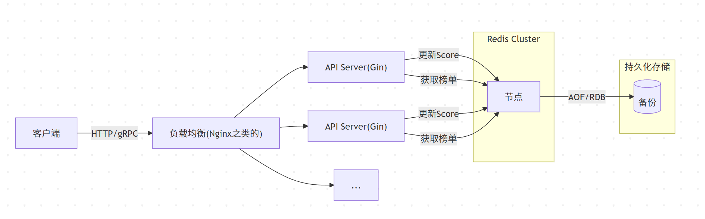

# LeaderBoardGin
go练手写的，由于使用redis的zest了，所以代码里的逻辑比较简单，goroutine和waitGroup还有defer什么的都没用上，就当熟悉语法了。  
gin的使用还需要去看下文档，通过GPT生成了框架，很多东西都没怎么了解就在用了。

## 大概流程

## 关于可靠性：
直接存redis了，redis有AOF和RDB保证可靠，并且这个程序也没啥内存泄漏的，直接7*24运行没啥问题，而且这个东西是无状态的，多机起几个都行，外层搞个负载均衡的就行了。  
想主动关的时候加一下redis的链接断开应该更好了，但是暂时不清楚gin有没有目前工作项目那样一个专门处理console的东西，后边可以再看看。
## 关于性能：
用pythonTool压测5W个请求，看服务器gin的输出，一个查询请求处理本地测基本在微秒级别，更新在几毫秒-十几毫秒的样子。并且用redis现查现回，都是实时的。  
关于ZSET：利用跳表（skip list）和哈希表双结构，理论上写入时间复杂度 O(log N)，N为百万时 log N≈20，单操作仍在数十纳秒级。

## 关于采用"密集排名"的计算方式
没写代码，但是想的是最方便的还是内存处理了，记录分数，每个分数存的是一个List,这样就能对于分数相同的玩家，将获得完全相同的排名位次。就是需要额外存个player->score的映射。
